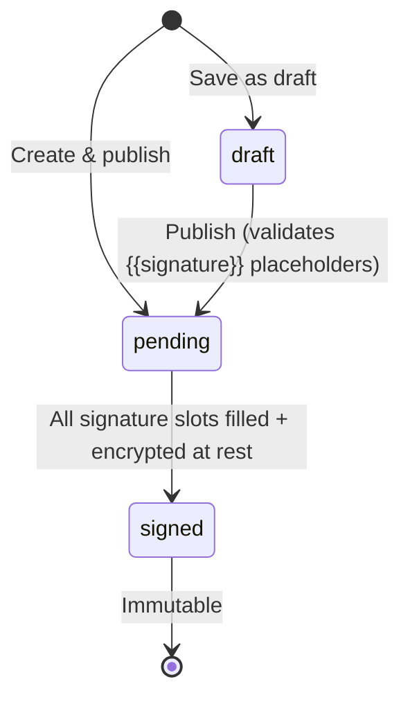

# WeAgree

**Secure Agreement Platform** — Create, share, and digitally sign agreements with trust and immutability.

   

---

## Overview

WeAgree is a web-based agreement platform that lets users create legally-oriented documents, share them via link or QR code, and collect cryptographically verified digital signatures. Every agreement is integrity-checked with SHA-256 hashing, signed with KMS-backed RSA-PSS signatures, and encrypted at rest with AES-256-GCM envelope encryption once fully signed.

### Key Features

- **Draft Agreements** — Save agreements as drafts and publish later
- **Template System** — Create reusable agreement templates; pre-fill new agreements from template data
- **Markdown Support** — Rich text rendering for agreement content with GitHub Flavored Markdown (GFM)
- **Diverse Signing Styles** — Sign by typing (3 fonts), drawing (signature pad), or uploading an image
- **Automated Notifications** — Resend-powered emails for signature requests and completion alerts
- **PDF Export** — High-fidelity, printable PDF downloads preserving all styling and signatures
- **KMS Cryptographic Signatures** — RSA-PSS signing with canonical JSON payloads and timestamped nonces
- **Envelope Encryption** — Finalized agreements are encrypted at rest (AES-256-GCM + RSA-OAEP key wrapping)
- **Content Integrity Verification** — Client-side SHA-256 hash comparison before signing
- **Robust Testing** — Full suite of unit/integration tests (Jest) and E2E smoke tests (Playwright)
- **Row-Level Security** — Supabase RLS ensures strictly controlled access to all agreement data

---

## Tech Stack

| Layer | Technology |
|-------|------------|
| Framework | [Next.js 14](https://nextjs.org) (App Router, Server Components, Server Actions) |
| Database | [Supabase](https://supabase.com) (PostgreSQL + Auth + RLS) |
| Notifications | [Resend](https://resend.com) (Transactional Email) |
| Testing | [Jest](https://jestjs.io) & [Playwright](https://playwright.dev) |
| Styling | [Tailwind CSS 3.4](https://tailwindcss.com) + Typography Plugin |
| Rich Text | [react-markdown](https://github.com/remarkjs/react-markdown) + GFM |
| Signatures | [react-signature-canvas](https://github.com/szimek/signature-pad-react) |
| PDF Export | [jsPDF](https://github.com/parallax/jsPDF) + [html2canvas](https://html2canvas.hertzen.com) |
| Cryptography | Node.js `crypto` (RSA-PSS, AES-256-GCM, RSA-OAEP) |

---

## Project Structure

```
we-agree/
├── app/
│   ├── actions/           # Server actions (agreements, templates)
│   ├── dashboard/         # Dashboard (Drafts, Pending, Signed, Templates)
│   ├── sign/[id]/         # Public signing page (Type/Draw/Upload modes)
│   └── ...                # create/, templates/, login/
├── components/            # Reusable UI (PDF Export, SignPad, Markdown)
├── e2e/                   # Playwright E2E smoke tests
├── lib/
│   ├── email/             # Resend utilities and HTML templates
│   ├── signing/           # Cryptographic signing/encryption core
│   ├── supabase/          # Database client configurations
│   └── ...                # signature utilities, database types
├── supabase/migrations/   # SQL migrations (schema, RLS, encryption)
└── ...                    # Configuration files (jest, playwright, tailwind)
```

---

## Getting Started

### Prerequisites

- **Node.js** ≥ 18.17
- A [Supabase](https://supabase.com) project
- (Optional) [Resend](https://resend.com) API Key for email notifications

### Setup

1. **Clone & Install**
   ```bash
   git clone <repo-url> && cd we-agree
   npm install
   ```

2. **Configure Environment**
   ```bash
   cp .env.example .env.local
   ```
   Fill in `NEXT_PUBLIC_SUPABASE_URL`, `NEXT_PUBLIC_SUPABASE_PUBLISHABLE_KEY`, `SUPABASE_SECRET_KEY`.
   Add `RESEND_API_KEY` for email support.

3. **Initialize Database**
   Apply migrations in `supabase/migrations/` sequentially.

4. **Verify Installation**
   ```bash
   npm test          # Run unit/integration tests
   npm run build     # Verify production build
   ```

5. **Start Dev Server**
   ```bash
   npm run dev
   ```

---

---

## Agreement Lifecycle



1. **Create** — Author writes content with `{{signature}}` placeholders
2. **Auto-sign** — Creator automatically signs slot 0
3. **Share** — Link or QR code sent to signers
4. **Sign** — Each signer picks an available slot, provides styled signature (Type/Draw/Upload)
5. **Finalize** — When all slots filled, content is encrypted at rest (AES-256-GCM)

---

## Security Model

- **Content integrity** — SHA-256 hash stored at creation; verified client-side before signing
- **Immutability** — DB triggers prevent modification of pending/signed agreement content
- **Cryptographic signatures** — RSA-PSS with canonical JSON payload, timestamped nonce (5-min window)
- **Encryption at rest** — Envelope encryption: AES-256-GCM data key + RSA-OAEP wrapped key
- **Row-Level Security** — Agreements visible to creator, signers, or via `pending` status for public links
- **CSRF protection** — Server actions with automatic Next.js CSRF handling

---

## Database Schema

Four core tables with Row-Level Security (RLS):

| Table | Purpose |
|-------|---------|
| `profiles` | Extends `auth.users` with `full_name`, `email`, `phone`, `wechat_openid` |
| `agreements` | Stores agreements with `content`, `content_hash`, `status`, encryption fields |
| `signatures` | Cryptographic signatures with `slot_index`, KMS key ID, signing payload |
| `templates` | Reusable agreement templates per user |

**Key constraints:**
- Content and hash are immutable once `pending` or `signed` (DB trigger)
- Signed agreements cannot revert status (DB trigger)
- Each signature slot can only be occupied once (partial unique index)
- Status auto-transitions via trigger on signature insert

---

## Agreement Lifecycle


1. **Create** — Author writes content with `{{signature}}` placeholders
2. **Auto-sign** — Creator automatically signs slot 0
3. **Share** — Link or QR code sent to signers
4. **Sign** — Each signer picks an available slot, provides styled signature
5. **Finalize** — When all slots filled, content is encrypted at rest (AES-256-GCM)

---

## Security Model

- **Content integrity** — SHA-256 hash stored at creation; verified client-side before signing
- **Immutability** — DB triggers prevent modification of pending/signed agreement content
- **Cryptographic signatures** — RSA-PSS with canonical JSON payload, timestamped nonce (5-min window)
- **Encryption at rest** — Envelope encryption: AES-256-GCM data key + RSA-OAEP wrapped key
- **Row-Level Security** — Agreements visible to creator, signers, or via `pending` status for public links
- **CSRF protection** — Server actions with automatic Next.js CSRF handling

> ⚠️ **Note:** The current KMS implementation uses an in-memory RSA keypair for development. Replace with a real KMS/HSM (e.g., AWS KMS, Google Cloud KMS) for production.

---

## Deployment

### Vercel (Recommended)

1. Push to GitHub and import into Vercel
2. Set all environment variables in Vercel project settings
3. Set `NEXT_PUBLIC_SITE_URL=https://your-app.vercel.app`
4. Update Supabase Dashboard → Auth → URL Configuration → Site URL to match

### Production Build

```bash
npm run build && npm start
```

---

## Scripts

| Command | Description |
|---------|-------------|
| `npm run dev` | Start development server |
| `npm test` | Run unit & integration tests (Jest) |
| `npm run test:e2e` | Run end-to-end smoke tests (Playwright) |
| `npm run build` | Create production build |
| `npm run lint` | Run ESLint |

---

## Versioned agreements, passkeys, and blockchain anchoring

Apply migration `008_versioned_agreements_passkeys_anchors.sql` (and earlier migrations) on your Supabase database.

- **GitHub** remains the account login (Supabase Auth).
- **Passkeys (WebAuthn)** are used as per-user signing credentials. Register them at **Settings → Passkeys** (`/settings/passkeys`). The creator’s first signature on a new agreement may still use server-side KMS signing so publish/create flows work without a prior passkey prompt; additional signers must complete a passkey assertion when passkey signing is required.
- **Agreement versions** live in `agreement_versions`. Pending agreements can be edited from the owner detail page; if others have already signed, saving creates a **new version** and previous signatures stay on the old version.
- **Finalization** happens when all required signatures are collected; content is then encrypted at rest and a **final proof hash** is anchored (mock chain in dev, or your HTTP endpoint via `BLOCKCHAIN_RPC_URL`). Receipts are stored in `agreement_version_anchors`.

### Proof export & offline verification

- Download a finalized agreement’s proof JSON from:\n  `GET /api/agreements/<agreementId>/proof`\n- Verify the proof locally (Ed25519 signature checks + hash binding):\n\n```bash\nnpm run verify:proof -- ./weagree-proof-<agreementId>.json\n```

### Environment variables

| Variable | Purpose |
|----------|---------|
| `WEBAUTHN_RP_ID` | WebAuthn relying party ID (defaults from `NEXT_PUBLIC_SITE_URL` hostname, else `localhost`) |
| `AGREEMENT_PASSKEY_REQUIRED` | Set to `false` to allow KMS-only signing without passkey (e.g. local dev). Defaults to required when unset. |
| `NEXT_PUBLIC_AGREEMENT_PASSKEY_REQUIRED` | Client UI: set to `false` to skip WebAuthn in the browser (must match server for consistent behavior). |
| `BLOCKCHAIN_RPC_URL` | Optional `POST` endpoint that accepts `{ "hash": "<final_proof_hash>" }` and returns chain receipt JSON |
| `BLOCKCHAIN_CHAIN_NAME` | Display name for the chain when using the mock anchor |
| `BLOCKCHAIN_EVM_RPC_URL` | (Vercel `/api/anchor`) EVM JSON-RPC endpoint URL (L2) |
| `BLOCKCHAIN_EVM_PRIVATE_KEY` | (Vercel `/api/anchor`) Private key used to submit anchor tx |
| `BLOCKCHAIN_EVM_CONTRACT_ADDRESS` | (Vercel `/api/anchor`) Deployed `WeAgreeAnchor` contract address |

---

## License

Private — All rights reserved.
