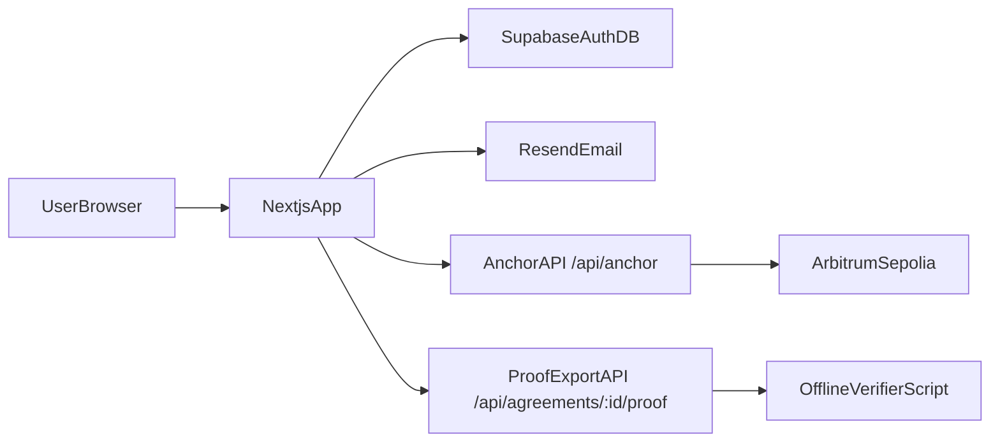
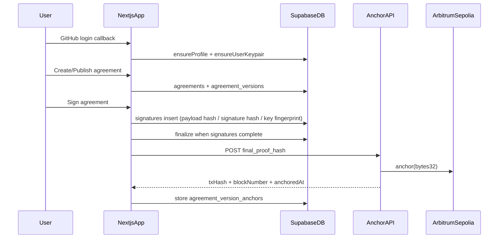
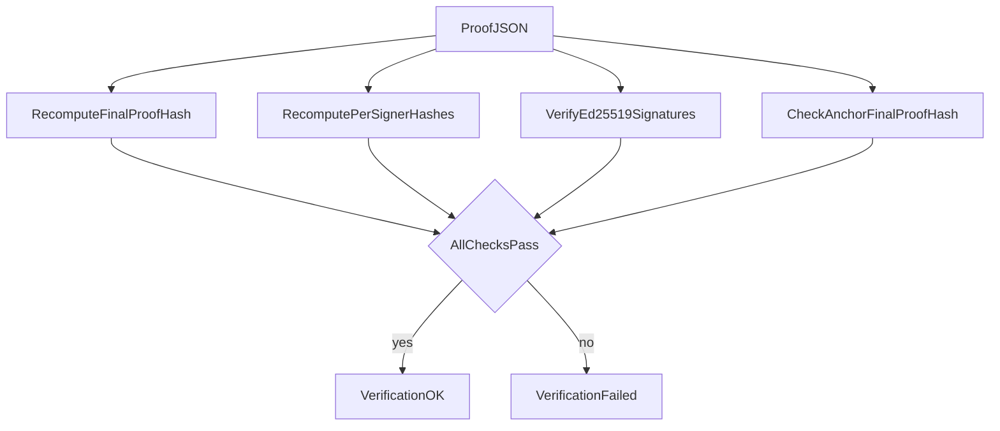

# WeAgree

Secure agreement signing platform with:
- GitHub OAuth login
- account-level cryptographic keypairs (auto-provisioned)
- optional passkey step-up authentication
- versioned agreements and multi-signer workflow
- blockchain anchoring of final proof hashes
- offline proof export and verification

## Tech Stack

- Next.js 14 (App Router, Server Actions)
- Supabase (Auth + Postgres + RLS)
- Resend (email)
- Ethers v6 (EVM anchoring)
- SimpleWebAuthn (passkeys)

## High-Level Architecture



## Core Workflow



## Data Model (Current)

- `agreements`: root agreement row (status, current/finalized version refs)
- `agreement_versions`: immutable finalized/superseded versions, editable open versions
- `signatures`: version-bound signatures + cryptographic evidence fields
- `agreement_version_anchors`: chain anchor receipt/status
- `user_keypairs`: per-user Ed25519 keypair metadata (public key + encrypted private key)
- `user_signing_credentials`: passkey credentials
- `webauthn_challenges`: short-lived passkey challenges

## Migrations

This repo currently tracks these migration files:
- `supabase/migrations/009_user_keypairs.sql`
- `supabase/migrations/010_signature_proof_fields.sql`

If your environment bootstraps schema from `supabase/INIT_ALL.sql`, apply that first, then apply `009` and `010`.

## Signing and Identity Model

- On login callback, app provisions:
  - profile (`profiles`)
  - account keypair (`user_keypairs`) if missing
- Agreement signature is generated with account keypair (Ed25519).
- Passkey is optional/step-up authentication:
  - when enabled, passkey assertion is verified and stored as extra evidence
  - passkey is not the core signing key

## Blockchain Anchoring

- Finalization computes canonical `final_proof_hash` from:
  - agreement/version identifiers
  - content hash
  - signer evidence summary (`signing_payload_hash`, `signature_hash`, key fingerprint/version, etc.)
  - signed timestamp
- App calls `BLOCKCHAIN_RPC_URL` with `{ hash: final_proof_hash }`
- Anchor API writes to EVM contract and returns:
  - `transaction_hash`
  - `block_number`
  - `anchored_at`
- App stores anchor receipt in `agreement_version_anchors`
- If anchor fails, status is stored as `failed` with error payload (no mock fallback)

## Environment Variables

### Supabase / App
- `NEXT_PUBLIC_SUPABASE_URL`
- `NEXT_PUBLIC_SUPABASE_PUBLISHABLE_KEY` (or `NEXT_PUBLIC_SUPABASE_ANON_KEY`)
- `SUPABASE_SECRET_KEY` (or `SUPABASE_SERVICE_ROLE_KEY`)
- `NEXT_PUBLIC_SITE_URL`

### Account Keypairs
- `USER_KEY_ENCRYPTION_KEY` (required; base64-encoded 32 bytes)

### Passkeys (optional)
- `WEBAUTHN_RP_ID` (optional; defaults from `NEXT_PUBLIC_SITE_URL` host)
- `AGREEMENT_PASSKEY_REQUIRED` (`"true"` to enforce passkey step-up)
- `NEXT_PUBLIC_AGREEMENT_PASSKEY_REQUIRED` (client-side UX toggle; should match server policy)

### Blockchain Anchoring
- `BLOCKCHAIN_RPC_URL` (e.g. `https://we-agree.vercel.app/api/anchor`)
- `BLOCKCHAIN_RPC_API_KEY` (optional bearer token protection)
- `BLOCKCHAIN_CHAIN_NAME` (display/metadata)
- `BLOCKCHAIN_EVM_RPC_URL` (used by `/api/anchor`)
- `BLOCKCHAIN_EVM_PRIVATE_KEY` (0x + 64 hex)
- `BLOCKCHAIN_EVM_CONTRACT_ADDRESS`

## Anchor API (`/api/anchor`)

Request:
- `POST /api/anchor`
- body: `{ "hash": "<64 hex sha256>" }`
- optional header: `Authorization: Bearer <BLOCKCHAIN_RPC_API_KEY>`

Response:
- `{ chain_name, transaction_hash, block_number, anchored_at }`

## Proof Export and Offline Verification

1) Download finalized proof:
- `GET /api/agreements/<agreementId>/proof`

2) Verify locally:

```bash
npm run verify:proof -- ./weagree-proof-<agreementId>.json
```

What verifier checks:
- recomputes `final_proof_hash`
- recomputes each `signing_payload_hash`
- recomputes each `signature_hash`
- recomputes signer key fingerprint from exported public key
- verifies each Ed25519 signature
- validates `anchor.final_proof_hash` consistency (if present)



## Development

Install and run:

```bash
npm install
npm run dev
```

Useful scripts:
- `npm run lint`
- `npm test`
- `npm run test:e2e`
- `npm run verify:proof -- <proof.json>`


## Production checklist

WeAgree ships with a local-development KMS shim (`lib/signing/kms-client.ts`)
that generates an ephemeral in-process keypair when no key is configured. This
is **not safe** for production deployments. Before going live, set:

| Variable                      | Purpose                                                                                |
| ----------------------------- | -------------------------------------------------------------------------------------- |
| `SIGNING_PRIVATE_KEY_PEM`     | PEM-encoded RSA key used by the local KMS shim. Required in production (the server throws on boot otherwise). |
| `SIGNING_KEY_ID`              | Stable identifier emitted with every signed proof.                                     |
| `USER_KEY_ENCRYPTION_KEY`     | 32-byte base64 secret used for AES-256-GCM encryption-at-rest of user signing keys.    |
| `SUPABASE_SECRET_KEY`         | Service role key (RLS-bypass). Restrict to backend hosts only.                         |
| `RESEND_API_KEY`              | Outbound email; rotate periodically.                                                   |
| `ANCHOR_RPC_URL`, `ANCHOR_PRIVATE_KEY`, `ANCHOR_CONTRACT_ADDRESS` | On-chain anchoring.                                            |
| `NEXT_PUBLIC_SITE_URL`        | Canonical origin; used in emails and OAuth callbacks.                                  |
| `WEBAUTHN_RP_ID`              | Hostname (no scheme) of the deployed app for passkey RP binding.                       |

### Threat model & key handling

- `USER_KEY_ENCRYPTION_KEY` is a custodial root key — its compromise discloses
  every user's signing key. Rotate by re-encrypting all `user_keypairs.encrypted_private_key`
  rows. Plan to swap `lib/signing/kms-client.ts` for a hosted KMS / TEE before
  scaling beyond pilot users.
- Final proof hashes are anchored on-chain; any change to `lib/signing/json-canonical.ts`
  output format would invalidate previously anchored proofs. Treat that file as
  append-only and add a new version function for breaking changes.
- Production deployments **must** override the security headers in
  `next.config.mjs` only to *tighten* them (e.g. swap `'unsafe-inline'` for a
  nonce strategy once the framework supports it stably).
